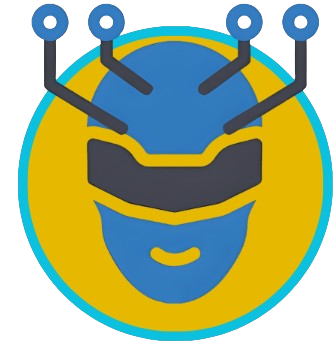

# 🤖 Counseltron

**Counseltron** is your AI-powered virtual counselor, ready to assist with insightful, thoughtful, and personalized responses! Unlike generic AI tools, Counseltron is built using a **handcrafted Large Language Model (LLM)**, making it unique and tailored for a seamless user experience. 🚀

## ✨ Features

- **💡 Handcrafted LLM**: Custom-built language model ensures accurate and relevant answers.
- **🎨 User-Friendly Design**: Beautiful, intuitive interface with a dark blue theme for a calm interaction experience.
- **📜 Persistent Conversations**: Retains context during chats to provide meaningful and coherent responses.
- **⚡ Fast Processing**: Optimized for modern GPUs to deliver quick replies.
- **🌟 Unique Greeting**: Always starts with: *"Hi, I am Counseltron, your AI counsellor."*

## 💻 Tech Stack

- **Model**: LLaMA-based handcrafted LLM.
- **Frontend**: HTML, CSS, and JavaScript, featuring a clean and responsive chat interface.
- **Backend**: Flask for handling user interactions and deploying the chatbot logic.

## 🚀 How It Works

1. **Initialization**: The chatbot greets users with a friendly message.
2. **User Interaction**: Users input queries or seek guidance.
3. **AI Response**: Counseltron processes the input and provides a meaningful, human-like response.

## 🎯 Goals

- Provide accessible and empathetic counseling via AI. 🌈
- Empower users with thoughtful and personalized advice. 🤝
- Expand the project's capabilities for more diverse applications. 🌍

## 💌 Future Plans

- **Multilingual Support** 🌐
- **Voice Input and Output** 🎤
- **Data Analytics for User Insights** 📊

---

🚀 *"Counseltron: Your personal counselor, 24/7, ready to guide and assist."* 🌟

